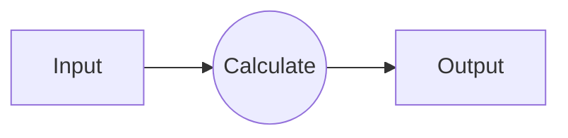
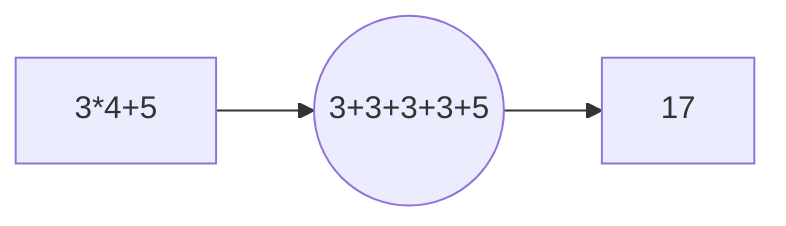

# Easy Predictor
> **Last Episode:**
> [How to make machine with intelligence](https://jihyo-jeon.github.io/post/How-to-make-machine-with-intelligence/)

##

Let us start with the very first step. Assume there is a computer that can think like human, doing dog image recognition or something like that. Then, we can draw a diagram like below.

This is exactly same with what we do with problems. However, as I said before, the computer is basically a calculator. So, the diagram is more like,

Let just think the problem is "3*4+5=?" instead of "Is this a dog?" to think in computer way. Then, the input is "3*4+5" which is the problem, and the circle in the middle is "3+3+3+3+5" which is calculating and the output will be 17.

## KRW - USD converter
Let's think of a more complicated machine. If computer is a calculator, it can also calculate won-dollar converter. The exchange rate is fixed at 1,100 won/$1. But, assume we do not know this ratio. (The real ratio is the answer, which is called **ground truth**) We can just imagine that it is a linear relationship.

$dollar = r * won$

$r$ is the ratio between won and dollar. If we don't the exact value of r, we need to find it from data.

| case | won | dollar |
|:----:|:---:|:------:|
|   1  |  0  |    0   |
|   2  |1100 |    1   |
